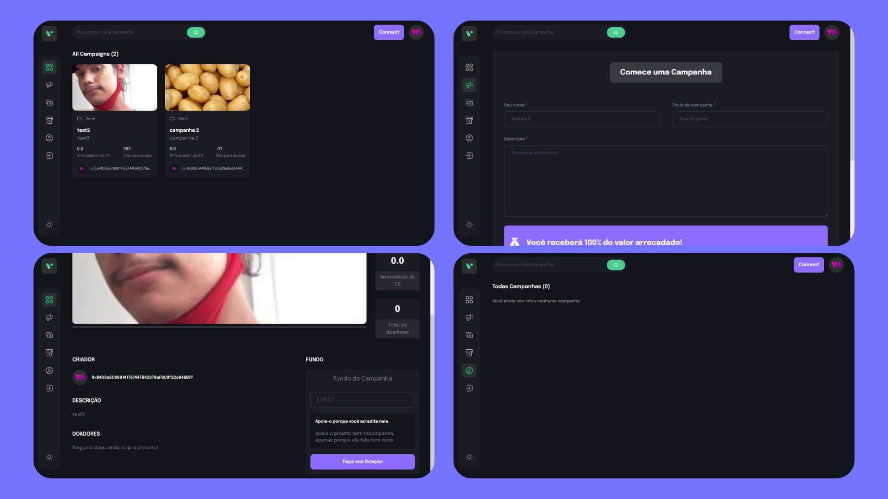

  

  <h2 align="center">Crowdfunding em Web 3.0</h2>

  Crowdfunding em Web 3.0 com contratos inteligentes ultilizando Cryptomoedas(ETH),  Responsivo, feito usando React js, Tailwind e Thirdweb para smart contracts na Web 3.0.

  <a href="https://crowdfunding-ompo.netlify.app"><strong>➥ Site Demo</strong></a>

 

### Demo Screeshots

### Projeto

O projeto tem com intuito criar um Crowdfunding em Web 3.0 com contratos inteligentes ultilizando Cryptomoedas(ETH).

* <a href="https://crowdfunding-ompo.netlify.app"><strong>➥ Acesse o Crowdfunding</strong></a>

 

### Difernças de outros Crowdfundings

* O site é feito na Web 3.0 com smart-contracts.
* Transações anônimas atravez de Metamask.
* 100% das doações ficam para os criadores das campanhas.
